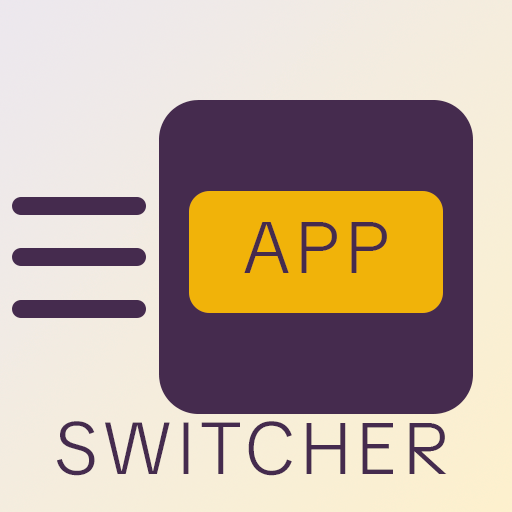
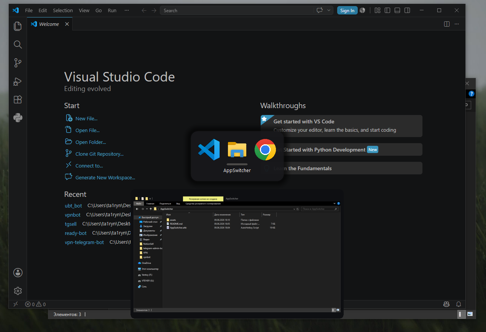
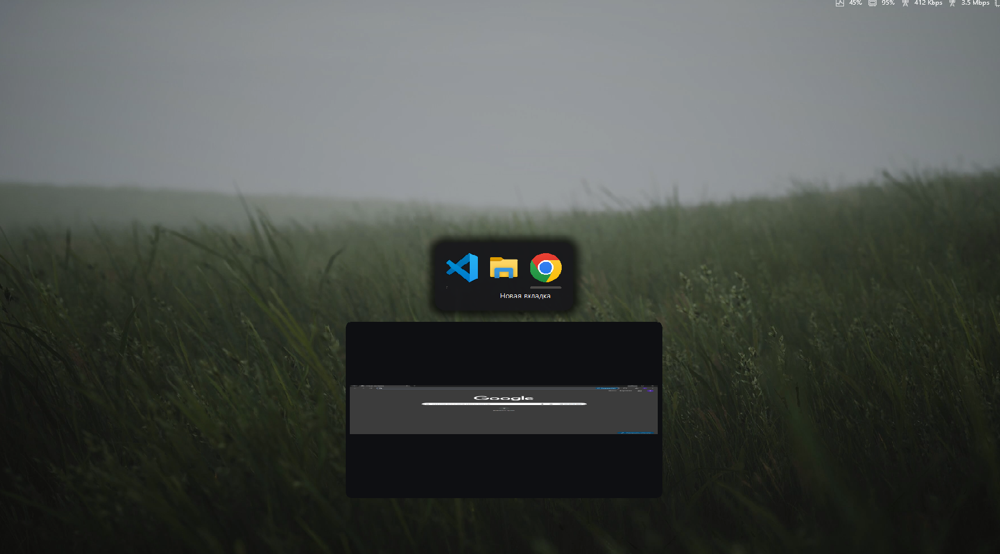

  

<h1 align="center">AppSwitcher-Windows</h1>

  Переключатель окон для Windows в стиле macOS. 
  A macOS-style window switcher for Windows.

  

---

## Русский

Переключатель окон на AutoHotkey.

управление: **Shift** + **Alt**. По центру экрана панель, в ней листаешь открытые окна. У каждого видно иконку, заголовок и живое превью того, что сейчас на экране. Отпустил Shift - переключился.

### Что умеет
- Панель по центру в стиле macOS: скруглённый фон, лёгкая подсветка акцентом.
- Один значок на каждое окно - без группировки и цифр-счётчиков.
- Живое превью выбранного окна со скруглёнными углами.
- Анимации Slide-in Fade-in Fade-out Slide-out
- Выбор мышкой.
- Отключает смену языка по Alt+Shift, чтобы хоткей не сбивал раскладку.

### Что нужно
- Windows 10 или 11
- [AutoHotkey v2.0+](https://www.autohotkey.com/)

### Установка
1. Поставь AutoHotkey v2.
2. Скачай `AppSwitcher.ahk` .
3. Дважды кликни по нему - скрипт запущен.
4. Хочешь автозапуск - положи ярлык в папку `shell:startup`.

### Управление
| Клавиши | Действие |
| --- | --- |
| Держать **Shift** + нажать **Alt** | Открыть переключатель / шаг к следующему окну |
| Держишь **Shift**, снова **Alt** | Ещё на одно окно вперёд за каждое нажатие |
| **←** / **→** | Двигать выбор вручную |
| **`** (бэктик) | Перебрать окна одного приложения |
| Навести курсор на иконку | Выбрать это окно |
| **Enter** или клик по иконке | Переключиться на выбранное |
| Отпустить **Shift** | Переключиться на выделенное |
| **Esc** | Отмена |

### Настройка
Открой `AppSwitcher.ahk` и поправь константы вверху файла:
- `ICON`, `GAP`, `PADX`, `PADY`, `RADIUS`, `GLOW` — размеры и вид панели.
- `PVW`, `PVH`, `PVPAD`, `PVGAP` — размер окна превью и отступы.
- `PvSlide`, `PvSteps` — дальность слайда и число кадров анимации.

### Если что
- Отключение Alt+Shift пишется в реестр и вступает в силу полностью после следующего входа в систему. `Win+Space` по-прежнему меняет раскладку.
- Скрипт работает с `#SingleInstance Force`, так что повторный запуск просто перезагружает его.

---

## English

A window switcher built in AutoHotkey v2. It's a single `.ahk` file with no dependencies — download it and run.

Hold **Shift** and tap **Alt**. A rounded, semi-transparent panel shows up in the center, and you flip through your open windows. Each one shows its icon, a clean title (no trailing “— Google Chrome”), and a live preview of what's on screen right now. Let go of Shift and you're switched.

### What it does
- macOS-style centered panel with a rounded backdrop and a soft accent glow.
- One tile per window — no grouping, no count badges.
- Live preview of the selected window with rounded corners.
- The new preview slides in from the side you're moving toward while the old one slides out the other way, both fading.
- Mouse support: hover an icon to select that window.
- Titles get cleaned up: “YouTube — Google Chrome” becomes “YouTube”.
- Picks up your Windows accent color.
- Turns off the Alt+Shift language toggle so the hotkey won't flip your layout.

### Requirements
- Windows 10 or 11
- [AutoHotkey v2.0+](https://www.autohotkey.com/)

### Install
1. Install AutoHotkey v2.
2. Download `AppSwitcher.ahk` (clone the repo or grab the single file).
3. Double-click it — that's it.
4. Want it on startup? Drop a shortcut into `shell:startup`.

### Controls
| Keys | Action |
| --- | --- |
| Hold **Shift** + tap **Alt** | Open the switcher / step to the next app |
| Keep **Shift**, tap **Alt** again | One app further per tap |
| **←** / **→** | Move the selection by hand |
| **`** (backtick) | Cycle windows of the selected app |
| Hover an icon | Select that window |
| **Enter** or click an icon | Switch to the selected one |
| Release **Shift** | Switch to the highlighted one |
| **Esc** | Cancel |

### Tweaking
Open `AppSwitcher.ahk` and edit the constants near the top:
- `ICON`, `GAP`, `PADX`, `PADY`, `RADIUS`, `GLOW` — panel size and look.
- `PVW`, `PVH`, `PVPAD`, `PVGAP` — preview box size and spacing.
- `PvSlide`, `PvSteps` — slide distance and frame count of the animation.

### Notes
- The language-toggle change goes into the registry and fully kicks in after your next sign-out. `Win+Space` still switches layouts.
- The script runs with `#SingleInstance Force`, so re-running it just reloads it.

---

## Скриншоты / Screenshots

   
  <em>Панель переключателя с превью / The switcher panel with a live preview</em>

   
  <em>Живое превью выбранного окна / Live preview of the selected window</em>

---

## License